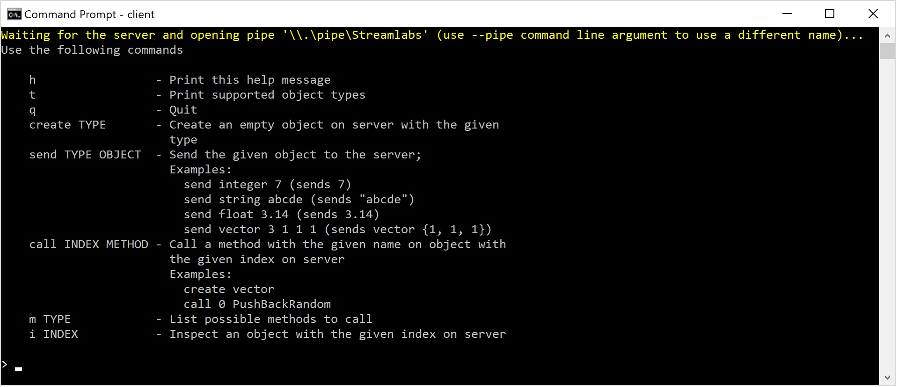

# StreamLabs Assignment

## Binaries

Binaries for Windows 32-bit/64-bit are located in `builds/`.

## Overview

This repository contains simple client/server console applications for Windows which can communicate through named pipe.

Application makes use of:

 * CMake - for builds
 * [cxxopts](https://github.com/jarro2783/cxxopts) - for command line options
 * [Asio](https://think-async.com/) - Powerful C++ network + I/O library which provides convenient interface for communication through a pipe handle; it supports both asynchronous and synchronous I/O, which is very useful for purposes of this application
 * [fmtlib](https://github.com/fmtlib/fmt) - Handy replacement for `cout` and `printf`, provides string formatting

## Usage

First you need to run the server
```bash
server
```
it will use the default pipe path. If you want to use a different path, use `--pipe` option:
```bash
server --pipe \\.\pipe\my
```
See `--help` for details:
```bash
server --help
```

Then you need to run the client
```bash
client
```
it has exactly the same command line options as the server.

If you managed to open the client, you will see a welcoming prompt and a help message. Type `h` command to see a help message with all the available commands.

Now you can play with the client.


